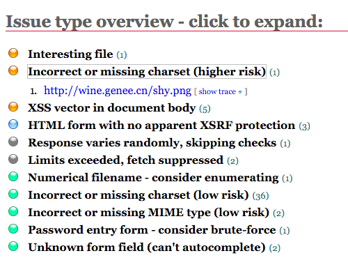
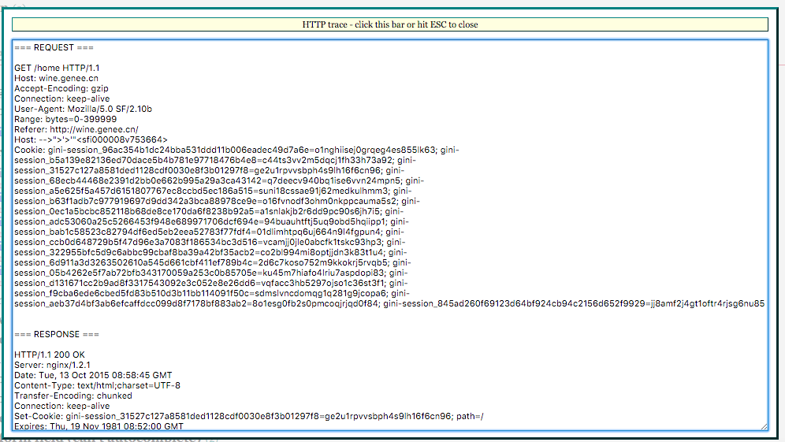

# skipfish 进行 web 安全检测

## 简述

skipfish 是 Google 出品的一个高性能的 web 安全检测工具, 具有 操作简单、速度快、覆盖面广、文档详细等特性

## 安装

**debian** 系统下我们可以直接使用 `apt` 进行 **skipfish** 安装.

```
sudo apt-get update && apt-get install -y skipfish
```

## 使用

skipfish 提供了丰富的参数供我们进行安全检测.

在进行 Lims2-CF/yiqikong 等项目检测中, 我使用如下几个参数进行检测, 效率快, 并且也覆盖到了需要的监测链接


```
skipfish -x 100 -d 100 -o 17kong 'http://17kong.com/'
```

参数说明:

* -x 节点抓取后代数目, 用于随机进行某个节点的后代抓取
* -d 最大抓取深度
* -o 结果输出目录

过多的 -x/-d 实际上并没有起到抓取目的, 适当检测即可

## 检测结果分析

检测完成后, 在 `-o` 参数对应的目录中会自动生成检测报告(html)

使用浏览器打开即可, 需要注意如下页面区域: `Issue type overview - click to expand`, 效果如下:



如上页面为检测结果中需要注意问题点, 按照 **严重 --> 建议** 的顺序进行排列

我们可逐一点击检测的标题后展开页面的  `show trace` 来查看详细的检测方式. 例如:


